# 生图工作流:每一步的约束原文

按执行顺序列出角色包生成的每一步:用了什么 prompt(原文)、什么算法(参数),各自约束什么、为什么。prompt 原文与代码一一对应,改代码必须同步改这里。

共享常量(`config.py`):

```
BG_MAGENTA = "SOLID MAGENTA background #FF00FF"   # 品红纯底,避开角色主色,便于色键抠图
NO_SHADOW  = "NO shadow"                          # 无阴影,阴影会污染抠图
CELL = 256          # 单帧输出边长
FOOT_RATIO = 0.90   # 脚底基线 ≈ y=238
```

---

## ① 母版生成 — `generate.gen_character`

**Prompt 原文:**

```
Create ONE original full-body pixel-art game character master sprite.
Character definition: {用户的角色定义}.
Art direction: {用户填的风格}.        ← 可选,留空不出现
Color scheme: {用户填的配色}.         ← 可选,留空不出现
Neutral standing pose, pseudo-side 3/4 view facing RIGHT. Clean readable silhouette.
SOLID MAGENTA background #FF00FF. NO shadow.
Character centered, full body head-to-feet, no text, no frame.
```

| 约束 | 约束什么 | 目的 |
|---|---|---|
| `pseudo-side 3/4 view facing RIGHT` | 视角与朝向 | 横版游戏向右行走的基准 |
| `Neutral standing pose` | 姿势 | 下游动作都从中立位出发 |
| `SOLID MAGENTA background` + `NO shadow` | 背景 | 色键抠图可靠 |
| `centered, full body head-to-feet` | 构图 | bbox 裁剪不缺胳膊少腿 |
| `Art direction` / `Color scheme`(用户自定义,前端①②步,可随机) | 风格与配色 | 审美交给用户;曾硬编码 chibi/克制配色/文艺幻想,已移除 |

---

## ② 母版门禁 — `describe.describe_character` + `generation_executor.run_character`

**VLM 判定 prompt 原文:**

```
You are building a game character sheet. Look at this character image and output STRICT JSON:
{"desc": "one concise English sentence capturing art style + key identity features
 (hair, outfit, props, colors, body type) — used to keep the character consistent across frames",
 "palette": "main colors, comma separated",
 "view": "front|profile|pseudo-side|three-quarter (the view in THIS image)",
 "facing": "left|right|viewer (which way the character faces)"}.
Be specific about distinguishing features (e.g. broken sword, antler crown), omit background.
```

**算法(门禁规则):**

```
合格 = view ∈ {profile, pseudo-side, three-quarter} 且 facing ≠ left
不合格 → 重新生成母版一次 → 仍不合格 → 任务失败
门禁调用自身报错 → 放行(质检故障不阻断生成)
```

| 约束 | 约束什么 | 目的 |
|---|---|---|
| view/facing 白名单 | 母版是否兑现①的视角要求 | ①的 prompt 模型可能不听;正面母版会让下游所有 prompt 自相矛盾,必须源头拦截 |

---

## ③ 动作条生成(默认路线)— `generate.gen_action_sheet`

**Prompt 原文:**

```
Create ONE ultra-wide horizontal pixel-art sprite action strip from the reference character.
The canvas MUST be landscape, close to 8:1 — about eight times wider than tall; never square,
never multiple rows.
The strip must contain EXACTLY 8 equal panels in one row, ordered left to right, with no borders,
gaps, labels, captions, duplicate panels or extra characters. Preserve the EXACT same identity,
face, hairstyle, costume, palette, pixel density and body proportions in every panel.
Character identity: {角色描述}. Action: {动作名}. Camera: true {view} game view.
EVERY panel must face the SAME direction as the reference character; NEVER mirror or flip any panel.
Keep the character at identical scale and the feet on one shared ground line. Each panel must show
a clearly different animation phase and together form a continuous loop.
SOLID MAGENTA background #FF00FF across the full strip. NO shadow.
Required left-to-right phases:
Panel 1: {姿势行1}
...
Panel 8: {姿势行8}
```

| 约束 | 约束什么 | 目的 |
|---|---|---|
| `8:1 / EXACTLY 8 equal panels / never multiple rows` | 布局 | ④能确定性等分切割 |
| `EXACT same identity ... every panel` | 跨帧一致性 | 同一次调用内身份不漂移 |
| `SAME direction / NEVER mirror` | 全条朝向 | 模型画行走爱镜像取巧,混向帧无法成动画 |
| `identical scale + shared ground line` | 比例与地线 | 切出的帧直接可拼动画 |
| `clearly different animation phase ... continuous loop` | 帧间差异 | 8 帧连起来是运动而非复制 |

---

## ④ 条校验与切分 — `processing.split_action_sheet`(算法)

```
拒收条件:宽 < 高×3(挡多行网格,它们 ≤2:1)或 单格宽 <32px
切分:横向 8 等分
缩放:全条先算一个公共缩放系数 min(fit_scale(每格bbox)),8 帧共用
     —— 禁止逐帧各自适配,否则张臂宽姿势帧会被单独缩小
失败后果:③重试一次,再失败回退⑤
```

| 约束 | 约束什么 | 目的 |
|---|---|---|
| ≥3:1 宽高比 | ③的返回格式 | 模型不听话(返回网格)时不产出垃圾帧 |
| 公共缩放系数 | 跨帧比例 | 规整环节自己不破坏一致性 |

---

## ⑤ 逐帧生成(回退/单帧修复)— `generate.gen_frame` + `action_pipeline._frames`

**外层帧合同(代码拼接)原文:**

```
{ACTION 大写} animation cycle, frame {N} of {总数}: {姿势行}
; true {view} game view, SAME facing direction as the reference
; stance, scale and silhouette IDENTICAL to the reference
 — change ONLY what this frame's pose requires; preserve exact pixel-art style
```

**内层 gen_frame prompt 原文:**

```
Image 1 = character identity master. Image 2 = the PREVIOUS animation frame; match its
costume, colors and held items exactly, changing only the pose.        ← 有上一帧时前置
Using the reference as exact identity and scale, redraw {角色描述}.
Pose for THIS frame: {上面的帧合同}.
Everything except the pose must stay IDENTICAL to the reference: hair color and style, face,
outfit, socks, shoes, palette, pixel density and every held item or accessory —
nothing added, nothing removed, nothing recolored.
SOLID MAGENTA background #FF00FF. NO shadow.
identical scale and vertical position, feet on same ground line.
```

| 约束 | 约束什么 | 目的 |
|---|---|---|
| 动作名 + 帧序 N/8 | 动作上下文 | 单帧调用也知道自己是哪个循环的第几帧 |
| `SAME facing direction` | 朝向 | 修掉"待机混出正面/侧面"的漂移 |
| `stance/scale/silhouette IDENTICAL` | 姿势幅度 | 压制自由发挥 |
| 上一帧作为第二参考图 | 细节连续性 | 服装道具不逐帧变异 |

---

## ⑥ 姿势行(唯一来源 `contracts/windup.v1.json`,经 `generate-contract.mjs` 生成两端)

**idle 八帧原文(每行喂给③的 Panel N 或⑤的帧合同):**

```
IDLE BREATHING, feet planted, stance and silhouette IDENTICAL to reference: neutral rest, breathing in
IDLE BREATHING, feet planted, stance and silhouette IDENTICAL to reference: shoulders and chest settle slightly down
IDLE BREATHING, feet planted, stance and silhouette IDENTICAL to reference: lowest point of breath, chest gently compressed
IDLE BREATHING, feet planted, stance and silhouette IDENTICAL to reference: rising back toward neutral
IDLE BREATHING, feet planted, stance and silhouette IDENTICAL to reference: neutral again with a tiny sway
IDLE BREATHING, feet planted, stance and silhouette IDENTICAL to reference: chest lifting, inhaling
IDLE BREATHING, feet planted, stance and silhouette IDENTICAL to reference: highest point of breath, chest expanded
IDLE BREATHING, feet planted, stance and silhouette IDENTICAL to reference: settling back to frame 1 to close the loop
```

**walk 八帧原文(合同式,节选前两帧,其余同构):**

```
WALK CONTACT: right heel forward, left leg extended behind, widest relaxed stride
WALK DOWN: right foot takes weight, body at lowest point, left foot lifting
...(PASSING / UP / OPPOSITE CONTACT / OPPOSITE DOWN / OPPOSITE PASSING / OPPOSITE UP)
```

| 约束 | 约束什么 | 目的 |
|---|---|---|
| 每行自带动作前缀 | 姿势语义 | 单行独立出现(⑤回退)时不被误读成别的动作 |
| `feet planted / IDENTICAL` (idle) | 姿势幅度 | 防止待机跑出行走帧 |

---

## ⑦ 抠图 — `processing.matte_chroma`(算法)

```
色键 = 四角像素均值;每像素 alpha = clamp((与色键距离 - 18) / 110 × 255)
若抠完前景仍 >60% → 回退 AI 主体分割 → 仍 >60% → 拒帧(要求重新生成)
```

| 约束 | 约束什么 | 目的 |
|---|---|---|
| 前景比 60% 上限 | 背景是否真的被去掉 | 带背景的帧不得流入资产 |

---

## ⑧ 规整 — `processing.normalize_frame`(算法)

```
bbox 裁剪主体 → 按④的公共系数缩放(≤224×208) → 贴到 256×256 画布
水平居中;脚底锚定 top = 238 - 主体高 - vertical_offset
vertical_offset:仅 jump 有逐帧偏移表 [0,18,42,62,38,0,0,0],其余动作恒为 0
```

| 约束 | 约束什么 | 目的 |
|---|---|---|
| 脚底锚定 y=238 | 地线 | 游戏运行时脚不飘 |
| jump 偏移表 | 纵向位移 | 锚定会抹掉整体位移,跳跃靠偏移表找回 |

---

## ⑨ 质检 — `processing.sequence_quality`(算法)

```
逐帧量 bbox:高度、水平中心、脚底 y、前景覆盖率
警告阈值:高度波动 >28% / 中心漂移 >42px / 脚线波动 >5px(jump 豁免)/ 覆盖率 >50%(疑似带背景)
只警告不拦截;语义连续性 semanticReviewRequired 恒为真,交人工审核
```

---

## 当前已知矛盾:待机是死的

⑤ 的 `IDENTICAL` ×2(帧合同 + idle 姿势行)把模型形变压到近零;⑧ 的脚底锚定又把任何整体纵向位移抹平(jump 偏移表的存在就是这个环节吃位移的证据)。两层叠加 → 待机 8 帧几乎逐像素相同。对症:⑧ 给 idle 加小偏移表(算法保底呼吸,零成本);⑤/⑥ 把 IDENTICAL 放宽为"站位轮廓一致,但必须有 2–3px 可见胸肩起伏"。

---

## 修改追溯

每次改动按三问记录:改的是什么问题 / 为什么原来会有问题 / 为什么改了能解决。留空待续。

### 2026-07-14

**1. 取图正则误存参考图**(`generate._call`)
- 问题:生成结果偶发与参考图完全相同。
- 原因:在整个响应 JSON 里全文正则抓第一个 base64 图,网关回显请求时抓到的是发出去的参考图。
- 解决:只在 `choices[0].message` 内取图,回显字段不在搜索范围,取不到图即报错而非静默存错图。

**2. 跨帧比例不一致**(`processing.split_action_sheet` / `normalize_frame`)
- 问题:同一动作里角色忽大忽小。
- 原因:每帧独立按自身 bbox 适配缩放,张臂等宽姿势帧被单独缩小。
- 解决:整条动作先算一个公共缩放系数,8 帧共用,规整环节不再自己制造比例波动。

**3. 动作条切分校验过松**(`processing.split_action_sheet`)
- 问题:模型返回 2×4 网格时被竖切成 8 份垃圾帧。
- 原因:校验只要求宽 ≥ 高×2,网格(约 2:1)恰好通过。
- 解决:阈值收到 3:1;多行网格 ≤2:1 必被拒,竖长格子合法条(3.33:1)不误伤,拒后走重试/逐帧回退。

**4. 母版视角违约无拦截**(`generation_executor.run_character` + `describe`)
- 问题:母版生成为正面,下游全部动作 prompt 与参考图自相矛盾,整包报废。
- 原因:prompt 要求伪侧面朝右但模型可能不听,管线无校验直接放行。
- 解决:生成后用 VLM 判 view/facing,不合格自动重生一次,再不合格任务失败;矛盾在源头拦截,不再流入动作生成。

**5. 逐帧回退丢失动作上下文**(`action_pipeline._frames`)
- 问题:待机帧里混入行走、不同视角。
- 原因:单帧 prompt 只有孤立姿势短语,不含动作名与帧序,"rising toward neutral" 被自由发挥。
- 解决:每帧 prompt 固定携带动作名+帧序 N/8+朝向锁+轮廓比例锁,模型知道自己在画哪个循环的哪一帧。

**6. idle 姿势行约束弱**(`contracts/windup.v1.json`)
- 问题:同上,idle 尤其失控。
- 原因:合同里 idle 行无动作前缀、无幅度限制;仓库里的强约束版本(actions.py)不是管线实际读的库。
- 解决:合同(唯一源)里 idle 八行统一加 "IDLE BREATHING, feet planted, stance IDENTICAL" 前缀,重新生成两端。
- 遗留:IDENTICAL 与脚底锚定叠加把待机锁死(见"当前已知矛盾"),待松绑。

**7. 风格被硬编码**(`generate.gen_character`)
- 问题:所有角色都被强制 chibi、克制配色、文艺幻想风。
- 原因:项目初期点灯人审美直接写死在 prompt 里。
- 解决:三个审美词移除,新增用户自定义 style/palette 字段(前端①②步,可随机),留空则交给模型;功能性约束(像素/全身/朝右/品红底)保留。

**8. walk 混出左右两个朝向**(`generate.gen_action_sheet`)
- 问题:同一条 walk 有朝左帧和朝右帧(镜像),无法成动画。
- 原因:动作条 prompt 锁了身份/比例/地线,唯独没锁朝向;姿势行描述的是腿部相位,不含行进方向;模型画行走循环时倾向镜像取巧。逐帧路线已有朝向锁,sheet 路线漏了。
- 解决:sheet prompt 增加 "EVERY panel must face the SAME direction as the reference; NEVER mirror or flip"——朝向从"未声明"变为显式合同,与逐帧路线对齐。

**9. walk 改走人定骨架逐帧,弃用动作条猜姿势**(`action_pipeline` + `skeleton_gen` + `generate.gen_frame`)
- 问题:walk 的手脚姿势靠 prompt 文字让模型猜,朝向锁修完后帧间姿势仍几乎不动、偶发身份漂移,8 帧构不成行走。
- 原因:队友仓库里已有确定性骨架系统(skeleton_gen 正弦相位定义每帧关节角、gen_frame 支持骨架条件图),但两头都没接线,调用者为零;动作条路线把 8 帧姿势全权交给模型想象。
- 解决:walk 强制走逐帧路线,每帧喂人定骨架图做姿势条件——姿势由代码定义而非 AI 猜;同时骨骼相位偏移 +π/2 使第 1 帧=接触位,与合同姿势行一一对应,图文不再矛盾;骨骼加定位点(固定地平线 y=494 + 全关节白点),gen_frame 的骨架说明同步告知模型地线锚定;顺带跳过 sheet 的格式校验/重试/回退整条链,流程反而简化。
- 契约变更:walk 的 generationRoute 由 sheet 改为 frames,两个契约测试同步更新;代价是 walk 从 1 次调用变 8 次。

**10. 骨架定位点泄漏进成品**(`generate.gen_frame`)
- 问题:骨骼约束首跑成功(8 帧同向、身份稳定、相位清晰),但骨架图里的灰色地平线被模型照抄进成品帧,脚下多一条细线。
- 原因:骨架说明只讲了"脚要按地线落位",没讲"地线本身不许画";品红抠图对灰线无效。
- 解决:骨架说明补一句 NEVER draw the line, dots or any skeleton element——锚只用于定位,不属于画面内容。

### 骨骼定位点约束图(纯代码生成,零 AI、零角色)

`skeleton_gen.make_walk_skeletons()` 用 PIL 逐笔画出——不调用任何图像模型,不含任何具体角色,只是几何。8 帧关节角由正弦相位公式算出,白点是定位点(头/颈/肩/肘/手/髋/膝/踝),灰色横线是固定地平线锚(8 帧共用同一 y=494)。这张图本身就是喂给 `gen_frame` 的姿势条件图,AI 只负责"照着骨架把已定的角色画上去",不负责决定手脚怎么摆。

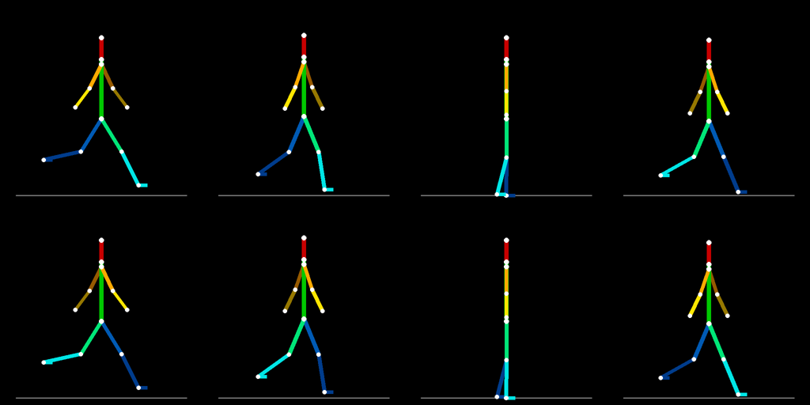

逐帧: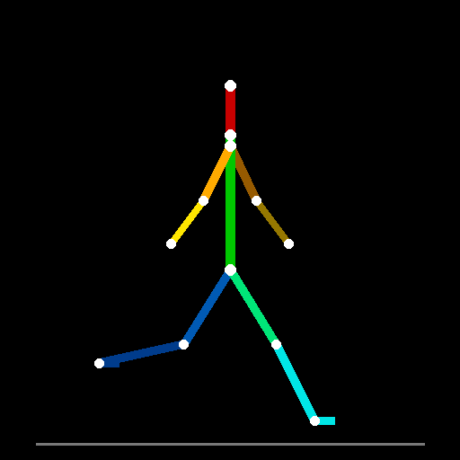 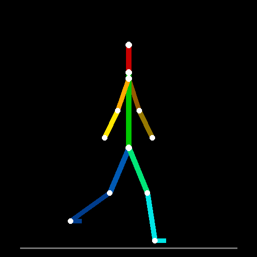 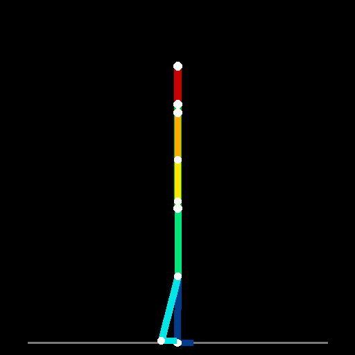 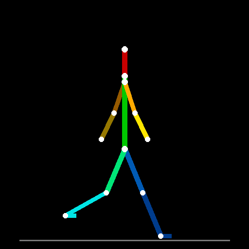 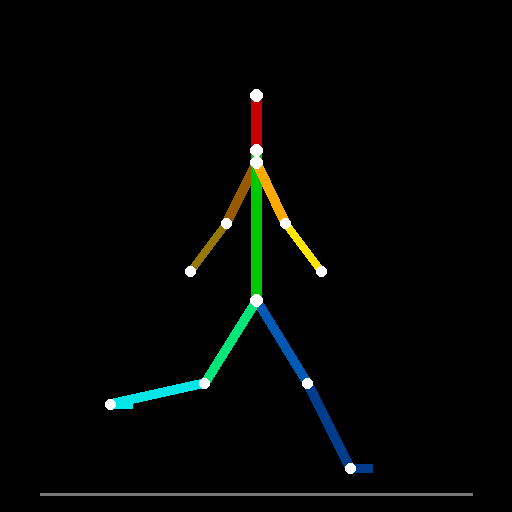 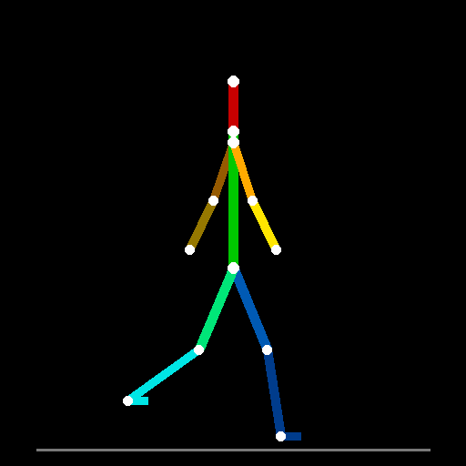 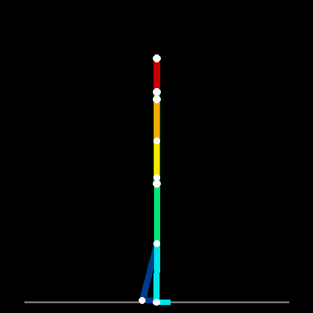 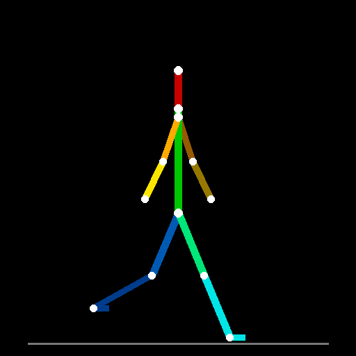

### 骨骼约束首跑成果(job 3effd91baafb,2026-07-14)

8 帧全部朝右、身份零漂移、步态相位清晰,几何质检零警告;遗留的地平线泄漏见追溯第 10 条(已修,待复跑验证)。

 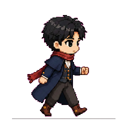 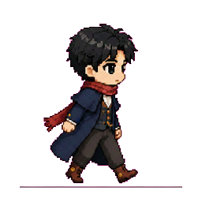 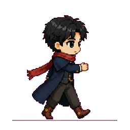  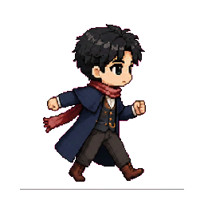 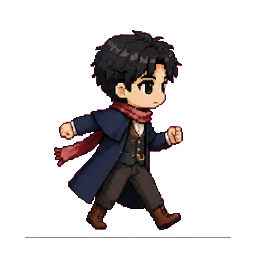 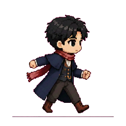

动画预览:

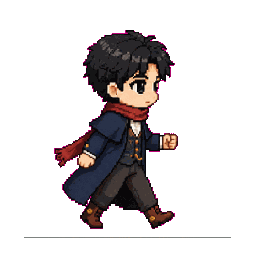

