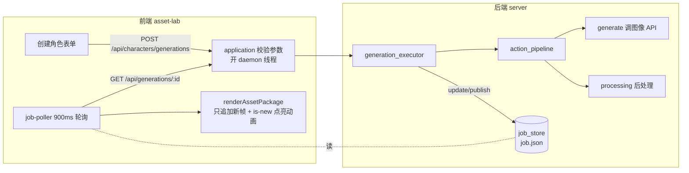
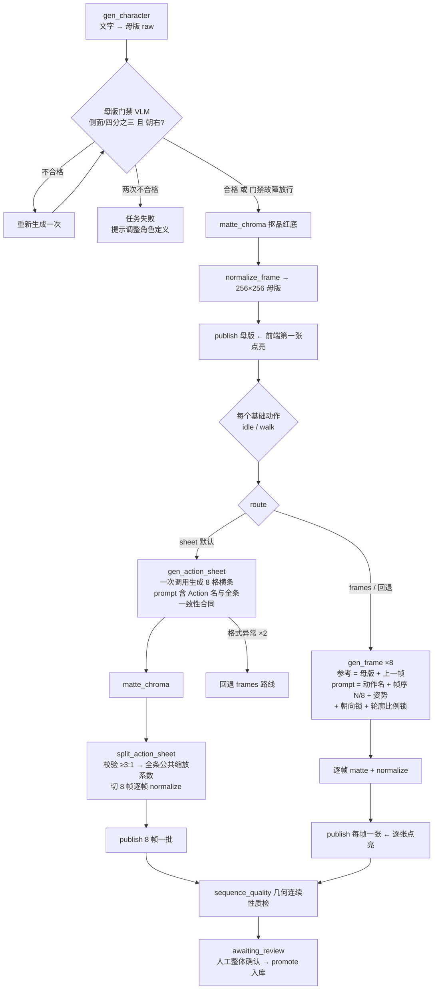
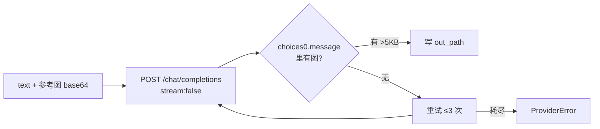

# 生图工作流

一个进程同时承担前端静态托管与生成后端(`python3 -m server.app --port 4174`,加 `--demo` 为演示模式)。前端轮询 job,后端逐张发布 outputs,新到的图片带点亮动画弹入。每步的 prompt 原文与约束参数见 `GENERATION_CONSTRAINTS.md`。

## 总览

## 角色包生成(run_character)

## 一次图像调用内部(generate._call)

只从 `choices[0].message` 提取图像——响应其他字段可能回显请求里的参考图,全文匹配会把参考图当生成结果(已修)。

## 一致性合同(三道锁)

| 锁 | 位置 | 内容 |
|---|---|---|
| 母版门禁 | `generation_executor.run_character` | 生成后用 VLM 判定 view/facing,非"侧面或四分之三 + 非朝左"重生一次,再不合格任务失败;门禁自身故障放行不阻断 |
| 单帧合同 | `action_pipeline._frames` | 每帧 prompt 必带:动作名大写 + 帧序 N/8 + 姿势行 + "SAME facing as reference" + "stance/scale/silhouette IDENTICAL, change ONLY the pose" |
| 姿势库单源 | `contracts/windup.v1.json` → `generate-contract.mjs` | 姿势文本唯一来源;idle 八帧均以 "IDLE BREATHING, feet planted, stance IDENTICAL" 开头,只描述呼吸位移;改姿势改合同再重新生成,不改生成物 |

## 关键约定

| 环节 | 约定 |
|---|---|
| 画布 | 每帧 256×256,主体贴 224×208,脚底基线 y=238 |
| 背景 | 生成时品红纯底 → 色键抠图,失败回退 AI 分割,仍 >60% 前景则拒帧 |
| 比例 | 同一动作条 8 帧共用一个缩放系数,禁止逐帧各自适配 |
| 动作条 | 必须 8 格单行、宽高比 ≥3:1,否则重试一次后回退逐帧 |
| 实时反馈 | 后端每 publish 一次,前端下个轮询只追加新帧并触发 `packageArrive` 点亮动画 |
| 计费 | sheet 路线 1 次调用/动作 + 母版门禁 1 次 VLM;frames 路线 8 次;demo 模式 0 次 |

## 已知取舍

- sheet 路线一次调用出 8 帧,便宜但生成期间(最长 240s)无逐帧反馈;frames 路线逐张反馈但 8 倍调用量。
- 回退时烧掉的 sheet 调用未计入 `sourceCallCount`;sheet 的 provenance 把整条耗时重复记给 8 帧。
- 生成请求无并发上限,每请求一个线程。
- `actions.py` 的 STANDARD 是旧 CLI 用的姿势库,与合同并存;活管线只读合同生成物。
- 待机双重锁死:单帧合同 IDENTICAL ×2 压制形变 + normalize 脚底锚定抹平纵向位移 → idle 近乎静止(详见 `GENERATION_CONSTRAINTS.md` 末尾)。
