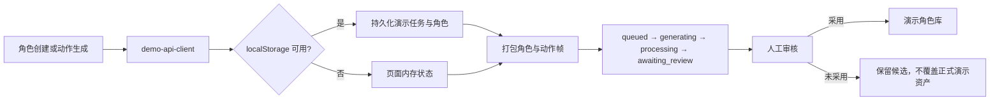

# 演示生成工作流

资产创作台现在是浏览器内完整演示闭环。静态后端保留同形状的演示兼容路由用于合同测试和本地集成，但产品页面不依赖这些 HTTP 路由。



## 角色创建

1. 校验名称、描述、风格、配色和基础动作。
2. 参考图只做浏览器内登记，不上传。
3. 根据文字和参考信息确定性选择一套打包演示形象。
4. 组装母版、待机 8 帧和行走 8 帧候选包。
5. 进入 `awaiting_review`，显式采用后写入演示角色库。

## 动作生成

1. 从演示角色库解析角色；缺失时提示并回退到 `boy`。
2. 完整动作复制合同规定的 8 个打包帧；单帧修复只复制指定帧。
3. 后处理继续执行画布、透明度、脚线和连续性质检。
4. 候选帧进入人工审核，不产生任何外部调用，`sourceCallCount` 固定为 `0`。

## 运行

```powershell
python -m server.app --port 4174
```

打开 `http://127.0.0.1:4174/asset-lab/`。即使后端兼容路由临时不可用，产品页仍可依靠浏览器演示 API 和打包素材完成闭环。
