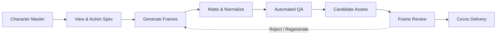

# Windup

### Character Asset Studio for Generation, Review and Cocos Delivery

Windup 是一套面向 2D 游戏角色的资产工作流原型。它将角色生成、动作分帧、几何质检、人工审核与 Cocos Creator 运行时验证连成一条可追溯的交付链路。

> 目标不是生成“一组看起来不错的图”，而是交付“一组经过审核、可修复、可追溯、进入引擎即可播放的角色资产”。

## Three repositories, one product

Windup 是本次比赛主项目的角色资产子系统，由三个队内仓库协同构成。主仓库管理比赛项目整体交付，本仓库负责产品化工作台，队友仓库负责角色生成管线。

| Repository | Ownership | Responsibility |
|---|---|---|
| **[game-asset-character](https://github.com/huyanxius/game-asset-character)** | 比赛主仓库 | 项目总入口、整体产品交付与比赛材料组织 |
| **[windup-asset-lab](https://github.com/huyanxius/windup-asset-lab)** | 当前子系统 | 生成入口、资产管理、逐帧审核、质检门禁、导出与 Cocos 联调 |
| **[windup-pipeline](https://github.com/johnnyzhang-eng/windup-pipeline)** | 队友管线 | 角色资产生成与处理、动作帧组织及资产实验实现 |

本仓库中的 `Boy`、`Skeleton` 和 `Lirael` 演示角色用于验证队友管线产物的导入、展示与播放。角色卡和 provenance 保留在 `artifacts/characters/`，集成适配层位于 `server/windup_pipeline/`。

### Collaboration contract

- 管线输出必须保留角色标识、视角、动作、帧序号与生成溯源。
- 横向 sprite sheet 按原始单元格无损切分，不二次缩放，不引入居中偏移。
- 工作台不直接覆盖正式资产；候选帧通过人工审核后才能进入 Cocos 交付目录。
- 后续集成应使用固定版本的 package 或 API 契约，避免两个仓库的内部实现强耦合。

## Product status

| Capability | Status |
|---|---|
| 多角色资产目录 | Available |
| 横屏侧视 / 俯视 / 2.5D 资产分组 | Available |
| 固定 8 FPS 播放与逐帧检查 | Available |
| 键盘控制与自动巡走 | Available |
| 洋葱皮、脚底线和锚点对齐 | Available |
| 生成任务与候选资产区 | Prototype |
| Alpha、主体高度、质心和循环接缝质检 | Available |
| 逐帧通过 / 退回与导出门禁 | Available |
| Cocos Creator Web 运行时同步 | Available |
| 分布式任务队列与生产级账户系统 | Planned |

## Workflow



跨视角一致性不只依赖提示词，而是依赖同一角色母版、固定角色描述、显式动作相位、统一脚底基线、局部修复与人工准入。

## Core experience

### Generate

- 按角色、视角和动作创建整套帧组候选。
- 生成过程通过后端代理，API Key 不进入浏览器。
- 候选资产与已发布资产隔离，采用前自动备份原帧。

### Review

- 固定 8 FPS 播放，支持逐帧、循环、洋葱皮和键盘控制。
- 自动质检识别画布错误、脚底漂移、主体比例波动与循环断层。
- 人工审核负责语义问题：步态、解剖、衣装细节、跨帧风格一致性。

### Deliver

- 所有帧通过后解锁导出。
- 当前角色、视角和动作可通过 `postMessage` 同步到 Cocos Web 运行时。
- 工作台与游戏构建均可作为静态前端部署。

## Quick start

### Requirements

- Python 3.11+
- Pillow
- Cocos Creator 3.8.8（仅编辑原始工程时需要）

### Run the studio

```bash
python3 -m pip install -r server/requirements.txt
python3 server/app.py --demo
```

Demo 模式不调用外部生成 API，可使用仓库内的演示资产跑通完整工作流。

### Run the Cocos target

```bash
python3 -m http.server 4173 --bind 127.0.0.1 --directory build/lamplighter-mvp
```

| Surface | URL |
|---|---|
| Windup Asset Lab | <http://127.0.0.1:4174/asset-lab/> |
| Cocos Web Runtime | <http://127.0.0.1:4173/> |

### Enable a generation provider

API 凭据只能注入后端进程，不得写入前端、Cocos 资产、`.env` 样例或 Git 记录。

```bash
SUFY_KEY="your-key" python3 server/app.py
```

| Variable | Purpose | Default |
|---|---|---|
| `SUFY_KEY` | OpenAI-compatible image API credential | none |
| `SUFY_BASE` | API base URL | `https://openai.sufy.com/v1` |
| `SUFY_IMAGE_MODEL` | Image generation model | `gemini-2.5-flash-image` |

## Generation API

```text
POST /api/generations
  character   lamplighter | boy | skeleton | lirael
  view        side | topdown | isometric
  action      idle | walk | run | jump | lantern
  mode        full | single
  frameIndex  0..7

queued -> generating -> awaiting_review -> approved
                    \-> failed
```

- 任务状态：`generation-data/jobs/`
- 正式采用前的原帧备份：`generation-data/backups/`
- 溯源数据：模型、提示、耗时、生成模式和批次信息

## Import teammate assets

队友管线输出的横向 sprite sheet 可通过内置适配器导入：

```bash
node tools/import-windup-sheet.js \
  /path/to/walk_sheet.png \
  assets/resources/characters/<character>/views/side \
  8 walk
```

适配器保留原始像素和单元格尺寸，避免二次插值造成的边缘污染、尺寸抽动和脚底偏移。

## Architecture

| Layer | Implementation | Responsibility |
|---|---|---|
| Studio UI | HTML / CSS / Vanilla JS | 生成入口、播放、逐帧审核、候选采用与导出 |
| Service | Python `ThreadingHTTPServer` | 静态服务、安全 API 代理、后台任务、备份和溯源 |
| Processing | Pillow + pipeline adapter | 去背景、256×256 归一化、帧序列组织与对齐 |
| QA | Canvas + Node tools | 几何连续性分析和可导出审计报告 |
| Runtime | Cocos Creator 3.8.8 | SpriteFrame 加载、8 FPS 播放和游戏内联调 |

## Repository map

```text
.
├─ asset-lab/                     # 生成、管理、审核与导出工作台
├─ assets/
│  ├─ resources/character/       # 点灯少年正式角色资产
│  ├─ resources/characters/      # 队友管线的多角色演示资产
│  └─ scripts/GameRoot.ts        # Cocos 运行时与联调协议
├─ artifacts/characters/           # 角色卡和 provenance
├─ server/
│  ├─ app.py                     # 后端代理、任务与候选采用
│  └─ windup_pipeline/           # 队友管线的原型集成适配层
├─ tools/                          # 切帧、归一化和动画审计工具
├─ build/lamplighter-mvp/          # 可静态部署的 Cocos Web 构建
├─ reports/                        # 质检数据与实测报告
├─ GAME_SPEC.md                    # MVP 游戏与角色规格
└─ HANDOFF.md                      # 当前交接状态
```

## Quality boundary

自动质检适合发现尺寸跳变、脚底漂移、主体面积突变和循环断层，但不能可靠判断步态语义、解剖正确性、衣装细节和“是否变脸”。

Windup 保留三个人工决策点：

1. 角色母版锁定。
2. 候选资产采用。
3. 逐帧通过与导出准入。

## Deployment and security

- `asset-lab/` 与 `build/lamplighter-mvp/` 可部署为静态站点。
- 启用真实生成时，必须同时部署后端或将 `/api` 转发到等价服务。
- 工作台与 Cocos 跨域部署时，需要同步调整 `GAME_ORIGIN`。
- 生成任务可能包含用户参考图和提示；生产环境应配置访问控制、数据生命周期和对象存储。
- 任何 API Key、App ID、凭据或私有生成资产均不得进入 Git。

## Roadmap

- 补齐三视角通用动作矩阵。
- 将单帧退回、相邻帧约束和候选替换闭环为稳定产品流程。
- 将模型、提示版本、成本、耗时和质检结果收敛到统一批次记录。
- 将本地文件任务管理升级为持久化队列与对象存储。
- 以版本化 package 或 API 稳定三仓库协作边界。

## Credits

- **Competition project and primary entry:** [huyanxius/game-asset-character](https://github.com/huyanxius/game-asset-character)
- **Asset generation pipeline and teammate assets:** [johnnyzhang-eng/windup-pipeline](https://github.com/johnnyzhang-eng/windup-pipeline)
- **Asset studio, review workflow and Cocos integration:** [huyanxius/windup-asset-lab](https://github.com/huyanxius/windup-asset-lab)

Windup is an active prototype. Interfaces and asset contracts may evolve before the first stable release.
