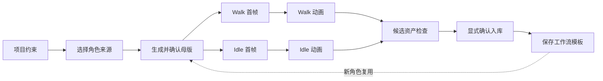

# Windup

### Character Asset Studio for Generation, Review and Cocos Delivery

Windup 是一套面向 2D 游戏角色的资产工作流原型。它将自由节点画布、角色生成、动作分帧、几何质检、人工审核、可复用流程与 Cocos Creator 运行时验证连成一条可追溯的交付链路。

> 目标不是生成“一组看起来不错的图”，而是交付“一组经过审核、可修复、可追溯、进入引擎即可播放的角色资产”。

## Three repositories, one product

Windup 是本次比赛主项目的角色资产子系统，由三个队内仓库协同构成。主仓库管理比赛项目整体交付，本仓库负责产品化工作台，队友仓库负责角色生成管线。

| Repository | Ownership | Responsibility |
|---|---|---|
| **[game-asset-character](https://github.com/huyanxius/game-asset-character)** | 比赛主仓库 | 项目总入口、整体产品交付与比赛材料组织 |
| **[windup-asset-lab](https://github.com/huyanxius/windup-asset-lab)** | 当前子系统 | 生成入口、资产管理、逐帧审核、质检门禁、导出与 Cocos 联调 |
| **[windup-pipeline](https://github.com/johnnyzhang-eng/windup-pipeline)** | 队友管线 | 角色资产生成与处理、动作帧组织及资产实验实现 |

本仓库中的 `Boy`、`Skeleton` 和 `Lirael` 演示角色用于验证队友管线产物的导入、展示与播放。`Boy` 只保留当前正式母版、待机与行走资产；其余角色的历史角色卡和 provenance 保留在 `artifacts/characters/`。集成适配层位于 `server/windup_pipeline/`。

### Collaboration contract

- 管线输出必须保留角色标识、视角、动作、帧序号与生成溯源。
- 横向 sprite sheet 按原始单元格无损切分，不二次缩放，不引入居中偏移。
- 工作台不直接覆盖正式资产；候选帧通过人工审核后才能进入 Cocos 交付目录。
- 后续集成应使用固定版本的 package 或 API 契约，避免两个仓库的内部实现强耦合。

## Product status

| Capability | Status |
|---|---|
| 多角色资产目录 | Available |
| 从文字创建“母版 + 基础动作”的可用角色包 | Available |
| 横屏侧视 / 俯视 / 2.5D 资产分组 | Available |
| 固定 8 FPS 播放与逐帧检查 | Available |
| 键盘控制与自动巡走 | Available |
| 洋葱皮、脚底线和锚点对齐 | Available |
| 一次生成动作条、自动切帧与单帧修复 | Available |
| Alpha、主体高度、质心和循环接缝质检 | Available |
| 逐帧通过 / 退回、版本化同步与导出门禁 | Available |
| Cocos Creator Web 运行时同步 | Available |
| 自由拖动、显式连线的节点创作画布 | Available |
| 母版、Walk / Idle 首帧与动画的分步确认 | Available |
| 工作流模板保存、复用和自动运行 | Available |
| 创作双入口与自然语言一键本地模拟 | Available |
| 分布式任务队列与生产级账户系统 | Planned |

## Workflow



跨视角一致性不只依赖提示词，而是依赖同一角色母版、固定角色描述、显式动作相位、统一脚底基线、局部修复与人工准入。

## Core experience

### Generate

- 整套动作默认一次生成 8 相位横向动作条，再确定性切为 8 张 256×256 帧。
- 新角色默认生成母版、呼吸待机和行走，3 次模型调用完成原本需要 17 次调用的角色包。
- 被退回的坏帧可单独修复，不需要重新生成整条动作。
- 生成过程通过后端代理，API Key 不进入浏览器。
- 候选资产与已发布资产隔离，采用前自动备份原帧。

### Review

- 固定 8 FPS 播放，支持逐帧、循环、洋葱皮和键盘控制。
- 自动质检识别画布错误、脚底漂移、主体比例波动与循环断层。
- 人工审核负责语义问题：步态、解剖、衣装细节、跨帧风格一致性。

### Deliver

- 所有帧通过后解锁导出。
- 当前角色、视角和动作可通过 `postMessage` 同步到 Cocos Web 运行时。
- 工作台与游戏构建均可作为静态前端部署。

### Reuse workflows

- 一次完整流程结束后，最终节点会将项目约束、来源、Walk / Idle 描述、FPS，以及节点连线、位置和画布视口保存为模板。
- 新建角色时选择已验证模板，填写新角色资料后，原节点图先完整还原，再按已验证顺序自动运行。
- 创作页在每次重新打开或硬刷新时回到启动方式选择，不会强制恢复上一次未完成项目；已保存流程仍由后端流程库存续。
- 每次运行都生成新 job，并记录模板 ID、版本和运行次数。
- 自动流程仍在 `awaiting_review` 停下；只有用户确认后才调用 promote 写入正式资产。
- 模板只保存配置，不保存 API Key、候选图片或临时任务数据。

### Natural-language quick creation

- 创作页首先提供“节点工作流”和“自然语言快捷创建”两个入口；节点工作流继续保留从零创建、上传母版和复用现有资产三种素材来源。
- 快捷创建在浏览器本地解析自然语言，并用样例资产依次模拟意图解析、母版、动作、质检和打包，不调用真实生成接口。
- 五阶段进度约 8 秒，可跳过过渡；完成后沿用现有的导出、发送到预览台和保存方案操作。
- 快捷创建沿用工作流原有的浅灰画布与墨绿色强调，输入、进度和结果页均提供返回创作方式、模式切换与响应式布局。

## Quick start

### Requirements

- Python 3.11+
- Pillow
- Cocos Creator 3.8.8（仅编辑原始工程时需要）

当前工作台是原生 ES Modules + Python 服务，不是 React/Vite 项目，因此不使用 `npm run dev`。

### Run the studio

```bash
python3 -m pip install -r server/requirements.txt
python3 -m server.app --demo
```

Demo 模式不调用外部生成 API，可使用仓库内的演示资产跑通完整工作流。

Windows 可以双击项目根目录的 `start.bat`。macOS 可以双击 `start.command`；如果系统首次下载后移除了可执行权限，先在终端运行：

```bash
chmod +x start.command
```

两个启动器都会检查 Python 3.11 与 Pillow，启动 5174 工作台和 5173 Cocos 预览，等待服务就绪后自动打开产品首页。macOS 启动器在同一个终端窗口中托管两个服务，按 `Control-C` 即可同时停止。

### Run the Cocos target

```bash
python3 -m http.server 5173 --bind 127.0.0.1 --directory build/lamplighter-mvp
```

| Surface | URL |
|---|---|
| 产品首页 | <http://127.0.0.1:5174/asset-lab/> |
| 项目资产 | <http://127.0.0.1:5174/asset-lab/#/library> |
| 节点创作画布 | <http://127.0.0.1:5174/asset-lab/#/studio> |
| 逐帧审核台 | <http://127.0.0.1:5174/asset-lab/review.html> |
| Cocos Web Runtime | <http://127.0.0.1:5173/> |

### Enable a generation provider

API 凭据可以在生成界面中连接，仅保留在当前后端进程内存，并按 HttpOnly 浏览器会话隔离；生成任务只接收凭据快照，不会写入任务 JSON。也可通过环境变量注入。凭据不得写入前端源码、浏览器存储、Cocos 资产或 Git 记录。

```bash
QNAIGC_KEY="your-key" python3 -m server.app
```

| Variable | Purpose | Default |
|---|---|---|
| `QNAIGC_KEY` | 七牛云 QnAIGC API credential | none |
| `QNAIGC_BASE` | API base URL | `https://api.qnaigc.com/v1` |
| `QNAIGC_IMAGE_MODEL` | Image generation model | `gemini-2.5-flash-image` |
| `WINDUP_ALLOWED_ORIGINS` | 逗号分隔的生产前端 Origin 白名单 | local origins |

部署时无需修改源码。页面加载前设置运行配置即可覆盖 API 与 Cocos 地址：

```html
<script>
window.WINDUP_CONFIG = {
  apiBase: 'https://api.example.com',
  gameOrigin: 'https://game.example.com',
  gamePath: '/build/',
};
</script>
```

## Generation API

```text
POST /api/generations
  character   lamplighter | boy | skeleton | lirael
  view        side | topdown | isometric
  action      idle | walk | run | jump | lantern
  mode        full | single
  route       sheet | frames  (full defaults to sheet)
  frameIndex  0..7

POST /api/characters/generations
  name, description, model
  starterActions  idle | walk  (defaults to both)

POST /api/quick-start
  prompt          12..800 字的自然语言角色需求
  name            可选；未传时从“名叫/叫做/角色名”推断
  starterActions  可选；未传时从待机/行走/奔跑/跳跃/提灯语义推断
  style, palette, model  可选

queued -> generating -> awaiting_review -> approved
                    \-> failed

GET  /api/workflows
POST /api/workflows
  name, description
  project    view, directions, canvasSize, style
  pipeline   source, actions, fps, briefs
  execution  automatic | guided

POST /api/workflows/{templateId}/runs
  name, description, style?, palette?, model?
```

两个角色创作入口的职责不同：

- **添加角色素材**：`POST /api/characters/generations`，用于结构化表单和程序化接入，必须明确传入角色名、完整定义与模型。
- **Quick Start**：`POST /api/quick-start`，用于一句自然语言开始创作；服务端推断名称和基础动作，然后复用同一条角色候选生成管线，仍需人工 `promote` 才会进入正式资产库。

```bash
curl -X POST http://127.0.0.1:5174/api/quick-start \
  -H 'Content-Type: application/json' \
  -d '{"prompt":"创建一名叫做雾灯守夜人的低饱和像素角色，需要待机呼吸和缓慢行走。"}'
```

两个入口都返回 `202` 生成任务，使用 `GET /api/generations/{jobId}` 轮询，并在审核后调用 `POST /api/generations/{jobId}/promote`。

- 任务状态：`generation-data/jobs/`
- 审核状态：`generation-data/reviews/`（乐观锁版本控制）
- 流程模板：`generation-data/workflows/`（原子 JSON 持久化）
- 正式采用前的原帧备份：`generation-data/backups/`
- 溯源数据：模型、提示、耗时、生成模式和批次信息

## Import teammate assets

队友管线输出的横向 sprite sheet 可通过内置适配器导入：

```bash
node tools/import-windup-sheet.js \
  /path/to/walk_sheet.png \
  assets/resources/characters/<character>/views/side \
  8 walk
```

适配器保留原始像素和单元格尺寸，避免二次插值造成的边缘污染、尺寸抽动和脚底偏移。

## Architecture

详细工程入口：

- [`docs/ARCHITECTURE.md`](docs/ARCHITECTURE.md)：系统结构、模块边界与状态所有权。
- [`docs/ENGINEERING_PLAYBOOK.md`](docs/ENGINEERING_PLAYBOOK.md)：从需求、生成、审核到发布的完整流程与升级触发条件。
- [`docs/DECISIONS.md`](docs/DECISIONS.md)：关键架构决策及其不可随意破坏的原因。
- [`CONTRIBUTING.md`](CONTRIBUTING.md)：新人进入、改动位置、完成标准与 Review 顺序。

| Layer | Implementation | Responsibility |
|---|---|---|
| Studio UI | HTML / CSS / Vanilla JS | 生成入口、播放、逐帧审核、候选采用与导出 |
| Service | Python `ThreadingHTTPServer` + Application Service | 薄 HTTP 适配、会话隔离、任务校验与用例编排 |
| Execution | `GenerationExecutor` + `ActionPipeline` | 后台生成、整条/单帧路由、进度、质检与溯源 |
| Assets | `AssetCatalog` + `AssetPublisher` | 正式目录清单、原子角色包入库、动作备份与失败回滚 |
| Workflow templates | `WorkflowTemplateStore` | 可复用配置、模板版本、运行次数与任务来源 |
| Processing | Pillow | 去背景、动作条切分、256×256 归一化与几何连续性 |
| QA | Canvas + Node tools | 几何连续性分析和可导出审计报告 |
| Runtime | Cocos Creator 3.8.8 | SpriteFrame 加载、8 FPS 播放和游戏内联调 |

## Repository map

```text
.
├─ asset-lab/                     # 角色资产中心、审核与导出工作台
├─ assets/
│  ├─ resources/character/       # 点灯少年正式角色资产
│  ├─ resources/characters/      # 队友管线的多角色演示资产
│  └─ scripts/GameRoot.ts        # Cocos 运行时与联调协议
├─ artifacts/characters/           # 角色卡和 provenance
├─ contracts/                       # 版本化产品契约与 Schema
├─ server/
│  ├─ app.py                     # 薄 HTTP 适配层
│  └─ windup_pipeline/           # 应用、执行器、动作管线、目录、发布、会话与供应商边界
├─ docs/ARCHITECTURE.md           # 模块边界、状态所有权与扩展约定
├─ tools/                          # 切帧、归一化和动画审计工具
├─ build/lamplighter-mvp/          # 可静态部署的 Cocos Web 构建
├─ reports/                        # 质检数据与实测报告
├─ GAME_SPEC.md                    # MVP 游戏与角色规格
└─ HANDOFF.md                      # 当前交接状态
```

## Quality boundary

自动质检适合发现尺寸跳变、脚底漂移、主体面积突变和循环断层，但不能可靠判断步态语义、解剖正确性、衣装细节和“是否变脸”。

Windup 保留三个人工决策点：

1. 角色母版锁定。
2. 候选资产采用。
3. 逐帧通过与导出准入。

已验证流程可自动重放生成节点，但不会自动 promote 正式资产。

## Deployment and security

- `asset-lab/` 与 `build/lamplighter-mvp/` 可部署为静态站点。
- 启用真实生成时，必须同时部署后端或将 `/api` 转发到等价服务。
- 工作台与 Cocos 跨域部署时，通过 `window.WINDUP_CONFIG` 配置地址，并在后端设置 `WINDUP_ALLOWED_ORIGINS`。
- 生成任务可能包含用户参考图和提示；生产环境应配置访问控制、数据生命周期和对象存储。
- 任何 API Key、App ID、凭据或私有生成资产均不得进入 Git。

## Roadmap

- 补齐三视角通用动作矩阵。
- 将单帧退回、相邻帧约束和候选替换闭环为稳定产品流程。
- 将模型、提示版本、成本、耗时和质检结果收敛到统一批次记录。
- 将本地文件任务管理升级为持久化队列与对象存储。
- 增加流程模板编辑、版本比较、删除与团队共享。
- 以版本化 package 或 API 稳定三仓库协作边界。

## Credits

- **Competition project and primary entry:** [huyanxius/game-asset-character](https://github.com/huyanxius/game-asset-character)
- **Asset generation pipeline and teammate assets:** [johnnyzhang-eng/windup-pipeline](https://github.com/johnnyzhang-eng/windup-pipeline)
- **Asset studio, review workflow and Cocos integration:** [huyanxius/windup-asset-lab](https://github.com/huyanxius/windup-asset-lab)

Windup 当前产品契约版本为 `1.1.0`；契约变更必须更新 `contracts/windup.v1.json` 并重新生成两端定义。升级后需重启 Python 服务，再重新连接 API Key。
