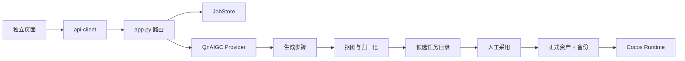

# Windup 架构说明

这份文档是代码导航和扩展约定。目标是让第一次进入仓库的人能快速判断：功能在哪里、状态由谁拥有、增加能力时应该改什么、不应该改什么。

## 设计原则

1. **一个状态只有一个所有者。** 人物播放与移动只由 `motion-state.js` 决策，页面不能直接拼装另一套运动状态。
2. **页面负责组装，不承载基础能力。** 网络、任务轮询、审核存储、质检、图集与游戏通信都由独立模块提供。
3. **候选资产和正式资产隔离。** 生成结果先进入任务目录，人工采用时才备份并写入正式目录。
4. **外部服务只有一个边界。** API Key、鉴权、超时、重试和上游错误只在后端 `provider.py` 中处理。
5. **可替换基础设施。** HTTP 页面不直接读写任务 JSON；未来将本地文件换成 SQLite、对象存储或队列时，接口层不需要重写。

## 运行结构

```text
asset-lab/
├─ app.js                       # 审核台极薄入口
├─ pages/editor.js              # 页面编排：把模块接到现有 DOM
├─ data/character-catalog.js    # 前端角色、视角、动作与帧目录
├─ core/
│  ├─ motion-state.js           # 纯动作状态机，无 DOM
│  ├─ api-client.js             # 唯一 HTTP 客户端
│  ├─ job-poller.js             # 生成任务生命周期轮询
│  └─ review-store.js           # 审核决策持久化
├─ features/
│  ├─ quality-check.js          # 帧几何质检
│  ├─ sprite-packer.js          # Cocos 图集和 metadata
│  └─ game-bridge.js            # 工作台与 Cocos 的消息协议
├─ generate.*                   # 独立动作生成页面
├─ create-character.*           # 独立新角色创建页面
└─ characters.*                 # 独立角色资产管理页面

server/
├─ app.py                       # HTTP 路由与生成用例编排
└─ windup_pipeline/
   ├─ config.py                 # 只放环境配置和固定规格
   ├─ domain.py                 # 角色、视角、动作、模型与动作相位词汇
   ├─ provider.py               # 七牛云鉴权、请求、重试和错误映射
   ├─ generate.py               # 组装图像模型请求
   ├─ processing.py             # 抠图与 256×256 归一化
   └─ job_store.py              # 可替换的任务持久化边界
```

## 关键数据流



生成任务状态只有一条合法主路径：

```text
queued → generating → awaiting_review → approved
                    ↘ failed
服务重启中的活动任务 → interrupted
```

## 人物交互契约

人物移动由 `core/motion-state.js` 中的纯状态机控制。任何按钮、键盘和人物点击都只发送事件：

- `CHARACTER_TOGGLE`：第一次点击开始自动行走，再次点击冻结，第三次从原位置恢复。
- `PLAYBACK_TOGGLE`：只切换帧播放，不偷偷修改人物位置。
- `AUTO_TOGGLE`：开启或停止自动巡走。
- `MANUAL_INPUT`：A/D、方向键和屏幕按钮共用的手动输入。
- `PAUSE_FOR_REVIEW`：逐帧审核时进入静止状态。

禁止给人物和舞台分别编写互相竞争的点击业务逻辑；禁止用 `stopPropagation()` 表达“开始或暂停”的状态转换。

## 如何扩展

### 增加动作

1. 在前端 `data/character-catalog.js` 增加动作名称和资产定义。
2. 在后端 `domain.py` 增加动作名与 8 个相位描述。
3. 放入对应的正式帧目录；页面、生成任务和导出会复用现有流程。
4. 为新的状态转换补纯函数测试，不在 DOM 事件里直接改多处状态。

### 增加角色

内建角色加到前后端目录；用户生成角色通过 `/api/characters/generations` 创建，确认后由后端写入运行时角色库。角色母版、动作候选和正式帧必须保持不同目录。

### 更换生成供应商

新增一个实现与 `provider.py` 相同职责的适配器，然后在服务启动配置中选择。页面不应感知供应商 SDK，也不能持有 API Key。

### 更换任务存储

实现 `JobStore` 的 `add`、`get`、`update`、`load` 语义即可。路由和生成流程不应依赖 JSON 文件结构。

## 维护红线

- 不在页面脚本中复制 `fetch`、轮询或资产 URL 拼接。
- 不在渲染函数中发起不可追踪的业务状态转换。
- 不让生成结果直接覆盖正式资产。
- 不把 API Key、生成会话、任务输出或用户提示提交到 Git。
- 不把不同视角伪装成 CSS 旋转；每个视角必须有独立资产。
- `styles.css` 只负责审核台表现；新增页面使用自己的页面级样式，业务逻辑不能依赖颜色或动画类名。

## 最小自检

```bash
node --test tests/*.test.mjs
python3 -m unittest tests/test_job_store.py
python3 -m py_compile server/app.py server/windup_pipeline/*.py
```

这些检查覆盖最容易回归的动作状态、审核持久化、API 地址规则与任务恢复。视觉验收仍由人工页面检查完成，不使用截图自动化替代产品判断。
