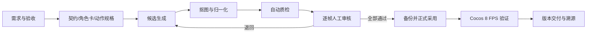
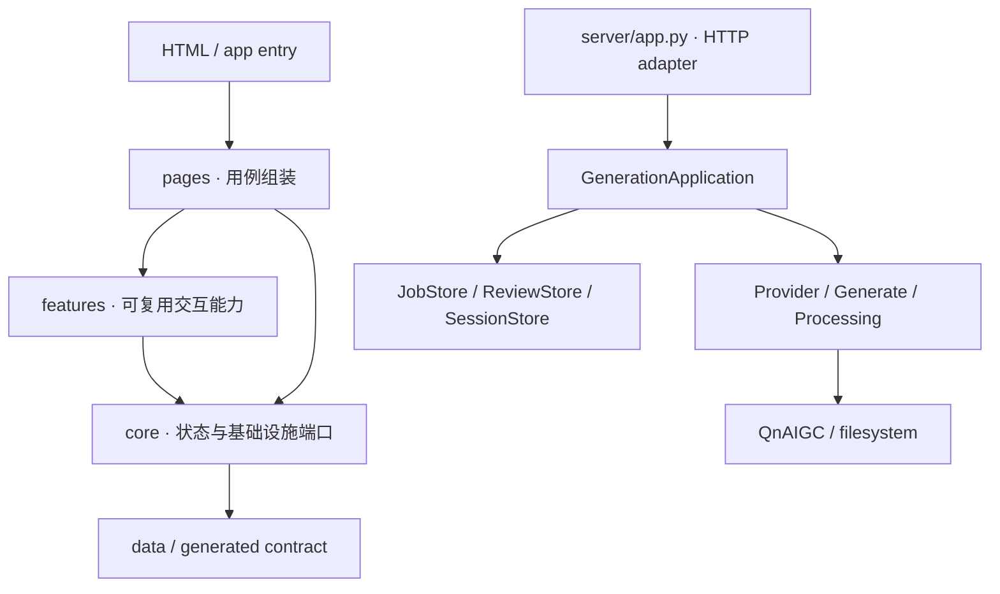

# Windup 工程与持续演进手册

## 目标

Windup 的可持续性不是“文件拆得越多越好”，而是让每次变更都有唯一入口、稳定契约、可替换边界和可验证的退出条件。团队增加角色、动作、模型、页面或部署环境时，不应重新理解整套系统。

## 端到端产品流程



### 每一阶段的退出条件

| 阶段 | 产物 | 退出条件 |
|---|---|---|
| 需求 | 验收标准与资产缺口 | 能说明成功、失败和不做什么 |
| 规格 | 版本化契约/角色卡/动作相位 | 前后端无重复定义，8 帧语义完整 |
| 生成 | 独立 job 与 provenance | Key 不落盘，任务可恢复或明确失败 |
| 处理 | 透明 256×256 帧 | 基线、比例、命名和 Alpha 合格 |
| 质检 | 几何检查结果 | 自动问题已标记，不冒充语义判断 |
| 审核 | 版本化逐帧结论 | 所有帧通过或明确退回帧 |
| 采用 | 正式资产 + 原帧备份 | 候选和正式目录边界完整 |
| 引擎 | Cocos 播放结果 | 8 FPS、循环、方向和尺寸符合契约 |
| 发布 | PR、版本与交接 | 队友 Review，部署配置和数据位置明确 |

## 依赖方向



依赖只能向下。页面可以组合能力，但 `core` 不知道页面；HTTP 可以翻译请求，但不知道生成步骤细节。`tools/check-boundaries.mjs` 会阻止最危险的逆向依赖、重复 fetch、重复定时器、全局 Key 和硬编码运行地址。

## 状态与数据寿命

| 数据 | 所有者 | 寿命 | 存储 |
|---|---|---|---|
| 角色/视角/动作/帧 | `EditorSession` | 页面会话 | 浏览器内存 |
| 播放与移动 | motion reducer | 页面会话 | 浏览器内存 |
| API 凭据 | `ProviderSessionStore` | 后端会话 | 仅进程内存 |
| 生成任务 | `JobStore` | 可恢复 | `generation-data/jobs` |
| 审核结论 | `ReviewStore` | 跨页面/协作 | `generation-data/reviews` |
| 候选资产 | job | 审核前 | job 目录 |
| 正式资产 | asset catalogue | 版本长期 | `assets/resources` |
| 溯源与备份 | promotion flow | 审计长期 | provenance/backups |

删除或迁移数据前必须先按这张表判断所有者和寿命，不能把临时数据误当正式资产，也不能让秘密进入持久层。

## 后续演进的触发条件

不要因“以后可能需要”提前引入重型基础设施；达到明确阈值再替换已有端口：

| 触发条件 | 升级动作 | 保持不变的上层契约 |
|---|---|---|
| 单进程同时任务经常排队或重启丢执行态 | 后台线程 → Redis/云任务队列 | generation job API/status |
| 任务/审核文件达到数万或需要查询统计 | JSON Store → SQLite/PostgreSQL | Store 方法和版本语义 |
| 多成员远程访问或涉及计费 | 内存会话 → 账户、RBAC、密钥托管 | provider session API |
| 资产体积不适合 Git/本机磁盘 | 文件目录 → 对象存储 + CDN | asset URL resolver |
| 前端领域模型继续增长并跨多人频繁修改 | 生成 `.d.ts` → 全面 TypeScript | versioned product contract |
| 三仓库需要独立发布 | 相对目录集成 → versioned package/API | character/action manifest |

## 故障处理顺序

1. 先确认失败属于页面状态、HTTP、应用用例、供应商还是图像处理。
2. 用 job ID、HTTP 状态和 provenance 定位，不用 UI 文案猜测成功。
3. 任何重试不得直接覆盖正式资产。
4. 上游 4xx 不盲重试；网络/5xx 使用有限退避；空图单独处理。
5. 服务重启把活动 job 标成 `interrupted`，由用户明确重发。
6. 审核 409 合并当前帧意图，不能静默覆盖其他人的决定。

## 每个迭代的固定节奏

```text
基线检查 → 小范围实现 → 逻辑/HTTP 验证 → 人工视觉验收
→ 文档事实同步 → 小提交 → PR Review → 合并 → 观察任务与存储
```

持续可维护的关键指标是：重复领域定义为 0、绕过 API 客户端的 fetch 为 0、全局 Key 写入为 0、未备份的正式覆盖为 0、架构检查持续通过。
