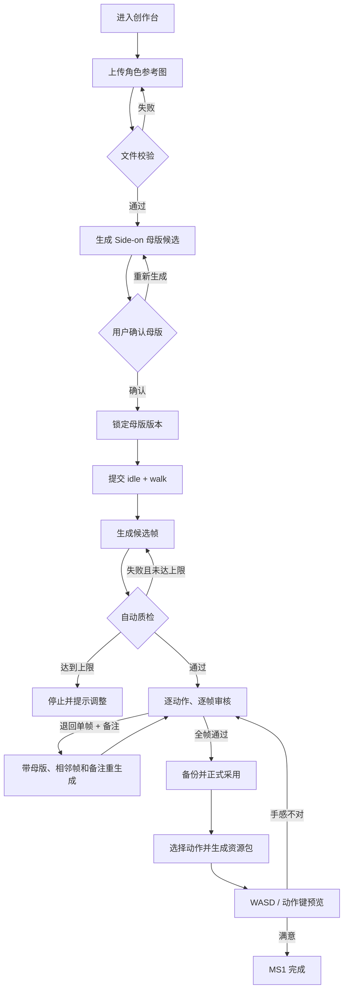
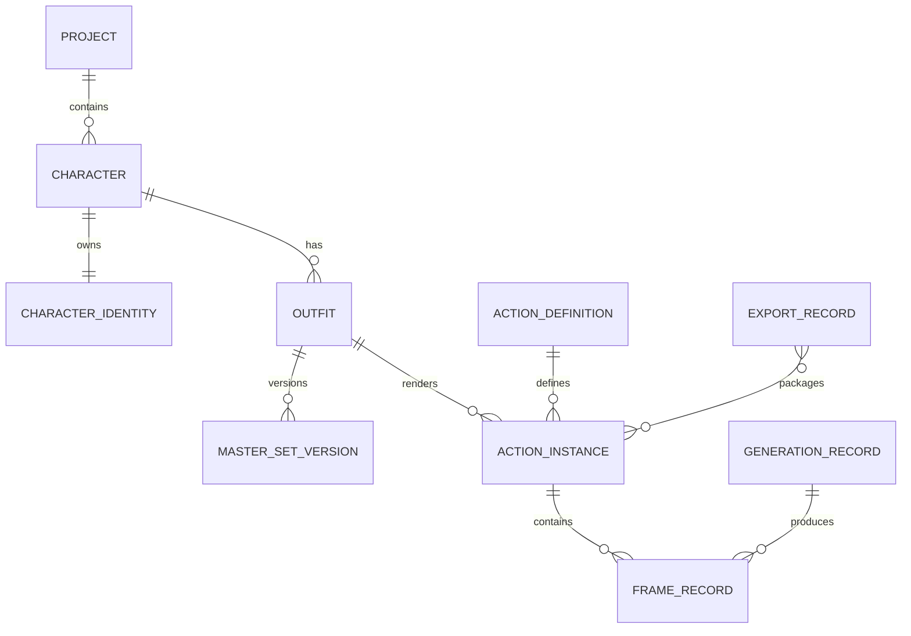

# MS1 最小可交付闭环实施方案

> 状态：Proposed
>
> 面向：产品、前端、后端、生成管线与验收人员
>
> 对齐：[Windup Issue #25](https://github.com/1024XEngineer/Windup/issues/25)、[Issue #3](https://github.com/1024XEngineer/Windup/issues/3)、[Issue #1](https://github.com/1024XEngineer/Windup/issues/1)
>
> 当前实现仓库：`huyanxius/windup-asset-lab`
>
> 相关约束：[架构说明](./ARCHITECTURE.md)、[架构决策](./DECISIONS.md)、[工程手册](./ENGINEERING_PLAYBOOK.md)

## 目录

1. [结论](#结论)
2. [为什么只做这条薄切片](#为什么只做这条薄切片)
3. [MS1 范围](#ms1-范围)
4. [用户闭环](#用户闭环)
5. [产品与技术决策](#产品与技术决策)
6. [领域模型](#领域模型)
7. [状态机与门禁](#状态机与门禁)
8. [API 方案](#api-方案)
9. [前端修改指导](#前端修改指导)
10. [后端修改指导](#后端修改指导)
11. [生成、质检与单帧修复](#生成质检与单帧修复)
12. [导出包与 Cocos 验收](#导出包与-cocos-验收)
13. [分 PR 实施顺序](#分-pr-实施顺序)
14. [测试与验收](#测试与验收)
15. [风险与失败处理](#风险与失败处理)
16. [Definition of Done](#definition-of-done)

## 结论

MS1 只交付一条真实、可重复验收的纵向闭环：

> 上传一张角色参考图 → 锁定 Side-on 母版 → 生成 `idle` 与 `walk` → 自动质检 → 逐帧审核 → 退回并单帧修复 → 正式采用 → 导出 Cocos 资源包 → WASD 预览。

固定约束：

- 单项目。
- 单角色。
- 单造型。
- 单方向 Side-on，角色反向由运行时镜像处理。
- `idle` 与 `walk` 各 8 帧。
- 8 FPS。
- 256 × 256 透明 PNG。
- 锚点为 `feet-center`。
- Cocos Creator / Web 预览为唯一交付目标。

MS1 的成功不是“页面齐全”，而是用户能把一张参考图变成无需重新切帧、改名和手调锚点的可播放角色包。

## 为什么只做这条薄切片

Issue #25 描述了三条入口、多向母版、资产树、动作清单、检查台、导出和引擎导入。全部同时实现会把产品验证拆散成大量页面与模型建设，无法证明 Windup 最核心的价值：把角色图稳定转成能进项目的动作资产。

上传参考图是 MS1 最值得验证的入口：

- 它符合首期目标用户“已有角色设定，需要补动作”的真实场景。
- 它避开“从零生成人设”的额外不确定性，将验证重点放在跨帧一致性和工程交付。
- 它仍覆盖母版锁定、动作生成、质检、审核、局部修复、正式采用与引擎导出全部核心边界。
- 它能直接与现有纯提示词工作流比较返工成本。

现有内建少年角色继续作为确定性 Demo fixture，用于 CI 和无 Key 演示，但不能代替真实参考图验收。

## MS1 范围

### 必须完成

- 创建一个默认 Project，并保存项目风格、视角模式、像素规格和目标平台。
- 上传 PNG/JPEG 参考图，校验类型、尺寸和文件大小。
- 从参考图产生一张 Side-on 母版候选。
- 用户确认后锁定母版版本；锁定版本不可原地修改。
- 基于锁定母版生成 `idle` 与 `walk`。
- 自动检查 Alpha、画布、脚底线、主体高度、相邻位移、近重复帧、循环接缝和明显地面线残留。
- 自动质检失败时有限重试；达到上限后停止并给出可操作错误。
- 检查台支持播放、暂停、逐帧、慢放、通过、退回和退回备注。
- 只重生成被退回帧；已通过帧不改变。
- 一个动作的全部帧通过后，动作才能标记完成并正式采用。
- 用户选择已完成动作生成资源包。
- 资源包包含透明帧、Sprite Sheet、GIF、JSON metadata、生成记录摘要和 Cocos 导入说明。
- 导出后能在 Web/Cocos 预览中用 A/D 或方向键移动，按动作键切换 `idle` / `walk`。

### 明确不做

- 从零生成角色。
- “已有资产出发”的完整产品入口；仅保留内部 fixture。
- Top-down、2.5D、4 向或 8 向母版。
- 多项目、多角色协作与权限。
- 多造型、换装、穿戴资产和跨角色复用。
- 自定义动作、姿势图上传、视频生成路线。
- 自定义 FPS、帧数、画布与锚点。
- 任意历史分支、跨角色 copy 和复杂版本图。
- Unity、Godot、Spine 或 DragonBones。
- 数据库、Redis、对象存储和账号系统。

这些能力可以在模型中保留 ID 和扩展字段，但不得进入 MS1 的页面、验收和关键路径。

## 用户闭环



### 用户可见的关键节点

用户只在四处做决定：

1. 选择并上传参考图。
2. 确认母版。
3. 审核动作帧并写退回备注。
4. 确认导出包在预览中可用。

模型调用、去背、切帧、归一化、自动重试和打包是系统内部过程，不要求用户理解。

## 产品与技术决策

### 保持 8 帧、8 FPS 固定

Issue #25 允许每个动作调整帧数和 FPS，但当前 `contracts/windup.v1.json` 将 8 FPS、动作相位和 8 帧生成语义定义为唯一产品契约。MS1 不改变这一契约。

领域模型仍保存 `fps` 和 `frameCount` 字段，当前校验只接受 `8`。后续放开配置时先修改版本化契约，再运行 `node tools/generate-contract.mjs`，禁止手改生成文件。

### 单造型实现，完整关系命名

MS1 页面只展示一个默认造型，但代码使用完整命名：

- `Character` 表示用户认知中的角色。
- `CharacterIdentity` 表示跨造型稳定的脸、体型和关键标志。
- `Outfit` 表示当前穿着与基准外观。
- `ActionDefinition` 表示可复用动作规格。
- `ActionInstance` 表示某造型执行某动作得到的帧集合。

不得把 `Character`、`Outfit` 和 `ActionInstance` 合并成一个扁平 JSON。

### Demo 与真实验收分离

- 自动化测试使用现有内建角色和 Demo provider，不消耗额度。
- 发布验收至少运行一次真实参考图和真实供应商链路。
- Demo 通过只能证明状态机和打包契约，不证明生成质量。

### 候选与正式资产继续隔离

所有新资产先进入 job 候选目录。只有人工全帧通过后，`AssetPublisher` 才能备份旧版本并原子写入正式目录。任何自动质检分数都不能直接触发正式覆盖。

## 领域模型

### 最小关系



### 建议字段

#### Project

```json
{
  "id": "project-windup-demo",
  "name": "Windup Demo",
  "artStyle": "低饱和文艺像素风",
  "viewMode": "side",
  "canvasSize": 256,
  "target": "cocos-wechat",
  "createdAt": "ISO-8601",
  "updatedAt": "ISO-8601"
}
```

#### Character、CharacterIdentity 与 Outfit

```json
{
  "character": {
    "id": "character-aran",
    "projectId": "project-windup-demo",
    "name": "阿岚",
    "identityId": "identity-aran-v1",
    "activeOutfitId": "outfit-aran-default"
  },
  "identity": {
    "id": "identity-aran-v1",
    "description": "短发、年轻信使、红围巾",
    "referenceAssetId": "upload-ref-001",
    "version": 1
  },
  "outfit": {
    "id": "outfit-aran-default",
    "characterId": "character-aran",
    "name": "默认造型",
    "activeMasterSetVersionId": "master-set-aran-v1"
  }
}
```

#### MasterSetVersion

```json
{
  "id": "master-set-aran-v1",
  "outfitId": "outfit-aran-default",
  "status": "locked",
  "sourceType": "uploaded_reference",
  "views": {
    "side": {
      "direction": "right",
      "assetPath": "generation-data/characters/character-aran/masters/v1/side.png"
    }
  },
  "createdAt": "ISO-8601",
  "lockedAt": "ISO-8601"
}
```

#### ActionDefinition 与 ActionInstance

```json
{
  "definition": {
    "id": "walk",
    "fps": 8,
    "frameCount": 8,
    "loop": true,
    "canvas": { "width": 256, "height": 256 },
    "anchor": "feet-center"
  },
  "instance": {
    "id": "action-aran-default-side-walk-v1",
    "outfitId": "outfit-aran-default",
    "definitionId": "walk",
    "view": "side",
    "status": "awaiting_review",
    "version": 1
  }
}
```

#### FrameRecord 与 GenerationRecord

```json
{
  "frame": {
    "id": "frame-walk-03-v2",
    "actionInstanceId": "action-aran-default-side-walk-v1",
    "index": 2,
    "assetPath": "generation-data/jobs/job-001/normalized/walk-03.png",
    "reviewStatus": "pending",
    "recordId": "record-job-001-frame-03-v2",
    "qc": { "passed": true, "warnings": [] }
  },
  "record": {
    "id": "record-job-001-frame-03-v2",
    "jobId": "job-001",
    "kind": "frame_repair",
    "model": "gemini-2.5-flash-image",
    "route": "frames",
    "attempt": 2,
    "elapsedMs": 4210,
    "cost": null,
    "parentRecordId": "record-job-001-frame-03-v1",
    "createdAt": "ISO-8601"
  }
}
```

API Key 永远不能进入以上结构。用户提示词与退回备注属于运行数据，不能提交到 Git。

## 状态机与门禁

### 母版状态

```text
draft → generating → awaiting_review → locked
                   ↘ failed
服务中断中的生成任务 → interrupted
```

- `locked` 版本只读。
- 重新生成产生新的候选或新版本，不覆盖已锁定版本。
- 没有锁定母版不能提交动作任务。

### 动作实例状态

```text
draft → queued → generating → quality_check → awaiting_review
                                              ↓
                         needs_repair ← rejected_frame
                                              ↓
                                           completed
                                              ↓
                                           promoted
```

- 自动重试达到上限后进入 `needs_input` 或 `failed`，不能无限循环。
- `completed` 的唯一条件是 8 帧全部人工通过。
- `promoted` 必须由显式采用操作触发，并保留备份。

### 帧审核状态

```text
pending → pass
        → reject → regenerating → pending
```

`reject` 必须允许附带备注。单帧修复产生新的 `GenerationRecord`，旧帧和旧记录保留。

## API 方案

现有接口保持兼容：

- `GET /api/health`
- `GET /api/characters`
- `POST /api/characters/generations`
- `POST /api/generations`
- `GET /api/generations/{job_id}`
- `GET/POST /api/reviews`
- `POST /api/generations/{job_id}/promote`

MS1 新增以下用例接口。`server/app.py` 只翻译 HTTP；校验和编排全部进入 `GenerationApplication` 或独立应用服务。

### Project 与资产树

```http
POST /api/projects
GET /api/projects/{project_id}
GET /api/projects/{project_id}/assets
```

`GET /assets` 返回项目、角色、默认造型、母版、动作实例、帧状态、资产缺口和生成记录摘要。前端不得自己扫描目录拼装第二套关系。

### 上传参考图

```http
POST /api/projects/{project_id}/references
Content-Type: image/png | image/jpeg
```

- 使用原始二进制请求体，避免 Base64 放大和 JSON 内存峰值。
- 默认上限 10 MB。
- 后端读取文件头验证真实类型，不能只相信扩展名。
- 返回不可猜测的 `referenceAssetId`，不返回本机绝对路径。

`asset-lab/core/api-client.js` 增加明确的 `upload()` 方法。其他页面仍禁止直接 `fetch`。

### 角色草稿与母版锁定

```http
POST /api/projects/{project_id}/characters/drafts
POST /api/master-sets/{master_set_id}/generate
POST /api/master-sets/{master_set_id}/lock
```

锁定请求必须携带预期版本，防止多标签页覆盖：

```json
{
  "expectedVersion": 2,
  "candidateAssetId": "candidate-master-side-002"
}
```

### 动作批次与修复

```http
POST /api/action-batches
POST /api/generations
GET /api/generations/{job_id}
```

`POST /api/action-batches` 只负责一次提交 `idle` 和 `walk`，内部仍为每个动作创建独立 job。单帧修复继续复用现有 `POST /api/generations`：

```json
{
  "character": "character-aran",
  "view": "side",
  "action": "walk",
  "mode": "single",
  "frameIndex": 2,
  "rejectionNote": "右脚与上一帧衔接断裂",
  "actionInstanceId": "action-aran-default-side-walk-v1"
}
```

### 导出

```http
POST /api/exports
GET /api/exports/{export_id}
GET /api/exports/{export_id}/download
```

导出用例必须重新检查动作状态，不能只相信浏览器提交的 `completed`。

## 前端修改指导

### 状态所有权

新增一个纯状态机 `Ms1CreationFlow`，只拥有以下状态：

- 当前 Project。
- 已上传 reference ID。
- 母版 job、候选与锁定版本。
- `idle` / `walk` job 与动作实例状态。
- 当前审核动作。
- 当前 export record。

页面负责组装，不在 DOM 事件中维护平行状态。生成轮询继续复用 `JobPoller`，动画播放继续通过 `PlaybackClock`。

### 建议新增文件

- `asset-lab/features/ms1-creation-flow.js`：纯状态机与命令。
- `asset-lab/features/reference-upload-controller.js`：文件选择、预览、上传与错误状态。
- `asset-lab/features/project-asset-tree.js`：把 API read model 转为页面展示模型。
- `asset-lab/pages/ms1-studio.js`：Composition Root。
- `tests/ms1-creation-flow.test.mjs`：状态转换测试。
- `tests/reference-upload-controller.test.mjs`：类型、大小和错误恢复测试。

### 建议修改文件

- `asset-lab/core/api-client.js`：增加二进制 `upload()`，保持会话 Cookie 与错误映射。
- `asset-lab/workflow-app.js`：用真实 API snapshot 驱动创作台，不使用定时器伪造完成。
- `asset-lab/pages/workflow-shell.js`：只渲染 snapshot；逐步将 MS1 片段移入独立 page/view 模块，避免继续扩大巨型文件。
- `asset-lab/features/asset-library-model.js`：消费 Project 资产树，不再把扁平角色目录当完整领域模型。
- `asset-lab/data/workflow-routes.js`：只保留 MS1 必需的创作、项目资产、检查台、导出和预览入口。
- `asset-lab/review.html` 与 `asset-lab/pages/editor.js`：显示动作实例与 Record 信息，提交退回备注。

### 页面行为

- 未上传参考图时只显示上传操作。
- 上传失败保留已填写角色描述，允许重试。
- 母版未锁定时禁用动作提交。
- 生成可以离开页面；返回后通过 job ID 恢复状态。
- 检查台清楚区分“自动质检通过”和“人工审核通过”。
- 有一帧 `pending` 或 `reject` 时导出按钮必须禁用。
- 后端错误显示 job ID 和可执行建议，不只显示 `Failed to fetch`。

## 后端修改指导

### 建议新增文件

- `server/windup_pipeline/project_models.py`：纯数据模型与反序列化校验。
- `server/windup_pipeline/project_store.py`：Project、角色、造型、母版版本和关系的原子 JSON Store。
- `server/windup_pipeline/reference_store.py`：参考图校验、命名和路径隔离。
- `server/windup_pipeline/export_service.py`：服务器端资源包与 manifest 生成。
- `server/windup_pipeline/quality_policy.py`：质检门禁、重试上限和失败原因映射。
- `tests/test_project_store.py`。
- `tests/test_reference_store.py`。
- `tests/test_ms1_http_flow.py`。

### 建议修改文件

- `server/app.py`：仅增加路由和二进制请求体适配，不吸收业务逻辑。
- `server/windup_pipeline/application.py`：增加 Project、母版锁定、动作批次和导出用例。
- `server/windup_pipeline/asset_catalog.py`：输出 Project 资产树 read model，并兼容现有内建角色。
- `server/windup_pipeline/generation_executor.py`：把 `masterSetVersionId`、`actionInstanceId` 和 `GenerationRecord` 传入执行上下文。
- `server/windup_pipeline/action_pipeline.py`：单帧修复携带锁定母版、前后相邻帧、动作相位和退回备注。
- `server/windup_pipeline/job_store.py`：保持任务恢复语义，补关联实体 ID。
- `server/windup_pipeline/review_store.py`：审核 key 改为稳定动作实例 ID，保留乐观锁。
- `server/windup_pipeline/publisher.py`：采用前检查 8 帧人工状态，失败时恢复备份。
- `server/windup_pipeline/project_store.py` / `generation_executor.py`：补 Generation Record ID、父 Record、耗时、模型和路线，不记录 Key。
- `server/windup_pipeline/processing.py`：补足实际阻断规则，避免再引入与主执行链断开的平行 QA 模块。

### 文件存储建议

遵循 ADR-004，MS1 使用文件 Store：

```text
generation-data/
├─ projects/<project_id>/project.json
├─ projects/<project_id>/characters/<character_id>/character.json
├─ projects/<project_id>/characters/<character_id>/outfits/<outfit_id>.json
├─ projects/<project_id>/characters/<character_id>/masters/<version>/manifest.json
├─ jobs/<job_id>/
├─ reviews/<action_instance_id>.json
├─ records/<record_id>.json
├─ exports/<export_id>/
└─ backups/
```

- 所有 JSON 先写临时文件，再原子替换。
- Store 自己持有锁；HTTP handler 不直接读写文件。
- 路径只接收经过校验的 ID，拒绝绝对路径和 `..`。
- `generation-data` 永远不提交 Git。

## 生成、质检与单帧修复

### 完整动作生成

完整动作仍由 `ActionPipeline` 决定使用动作条或逐帧路线。页面只提交输出规格，不感知供应商实现。

- 输出契约永远是 8 张独立 256 × 256 PNG。
- 动作条尺寸或格式异常时可以回退逐帧。
- 供应商鉴权、配额和参数 4xx 直接失败，不伪装成切帧错误。
- 每个动作最多执行 2 次自动质量重试；达到上限进入 `needs_input`。

### 自动质检必须阻断的问题

- 图片不是 256 × 256。
- 缺少 Alpha 或主体为空。
- 主体超出画布。
- 脚底线偏差超过帧高 3%。
- 相邻帧主体位移异常。
- 近重复帧导致动作实际不动。
- 第一帧与最后一帧循环接缝异常。
- 地面线、阴影底板或背景残留。
- 相邻帧主体高度和轮廓出现异常突变。

自动质检仍不能判断完整的脚步语义、解剖和角色身份，以下项目必须人工确认：

- 8 帧看起来确实是同一个角色。
- `walk` 有清晰的左右脚交替和重心变化。
- `idle` 有可见但克制的呼吸变化，不是重复静帧。
- 没有额外肢体、装备漂移和脸部突变。
- 8 FPS 播放时没有明显闪烁、跳脚或瞬移。

### 单帧修复上下文

单帧修复请求至少携带：

- 锁定母版。
- 当前动作定义和目标相位。
- 前一帧与后一帧；首尾帧按循环语义取邻居。
- 被退回帧。
- 用户退回备注。
- 当前造型与画布规格。

修复结果先成为候选新版本。旧帧继续保留，直到新帧人工通过并随动作采用。

## 导出包与 Cocos 验收

### 目录结构

```text
windup-<project>-<character>/
├─ preview/
│  ├─ idle.gif
│  └─ walk.gif
├─ frames/
│  ├─ idle/idle-01.png ... idle-08.png
│  └─ walk/walk-01.png ... walk-08.png
├─ sheets/
│  ├─ idle.png
│  └─ walk.png
├─ metadata/actions.json
├─ cocos/README.md
├─ provenance/manifest.json
└─ LICENSE-GENERATION.md
```

### metadata 最小字段

```json
{
  "version": "windup-export.v1",
  "characterId": "character-aran",
  "outfitId": "outfit-aran-default",
  "masterSetVersionId": "master-set-aran-v1",
  "canvas": { "width": 256, "height": 256 },
  "anchor": "feet-center",
  "actions": {
    "idle": { "fps": 8, "loop": true, "frames": 8 },
    "walk": { "fps": 8, "loop": true, "frames": 8 }
  }
}
```

### 预览验收

- `idle` 自动播放。
- A/D 和左右方向键触发 `walk`，松开回到 `idle`。
- 向左时使用运行时镜像，不生成第二套帧。
- 播放时保持 8 FPS。
- 人物脚底不漂移，碰撞与舞台位置不重置。
- 预览加载的必须是刚导出的正式版本，不是内建 Demo 资产。

## 分 PR 实施顺序

### PR 0：基线与仓库统一

目标：建立可信起点。

- 明确 `1024XEngineer/Windup` Issue 与 `huyanxius/windup-asset-lab` 实现仓库的合入关系。
- 合入当前自定义端口与 Production 状态修复。
- 修复 Windows 边界检查的路径标准化。
- 修复 Demo `/promote` HTTP 400。
- 让完整门禁在 Windows 本机可执行。

退出条件：契约、边界、前端、后端、语法和 `git diff --check` 全部通过。

### PR 1：Project 模型、Store 与资产树 API

目标：把当前扁平角色目录升级为最小真实领域关系。

- 新增 Project、CharacterIdentity、Outfit、MasterSetVersion、ActionInstance、FrameRecord、GenerationRecord。
- 建立原子文件 Store。
- 将现有内建角色映射到默认 Project 和默认 Outfit，保持兼容。
- 实现 `GET /api/projects/{id}/assets`。

退出条件：服务重启后关系不丢失；资产缺口与 Record 可从 API 查询。

### PR 2：参考图上传与母版锁定

目标：跑通真实入口与第一个人工确认点。

- 二进制上传、安全校验和预览。
- 创建角色草稿。
- 生成 Side-on 母版候选。
- 乐观锁确认并生成只读 MasterSetVersion。

退出条件：没有锁定母版不能创建动作任务；重新生成不覆盖锁定版本。

### PR 3：idle/walk 动作批次与状态恢复

目标：由锁定母版产生两个独立动作实例。

- 一次提交 `idle` + `walk`。
- 每个动作独立 job、独立失败、独立重试。
- 页面离开后能通过 job ID 恢复。
- 生成 Record 关联到动作实例和帧。

退出条件：Demo fixture 稳定产出 16 张真实文件；真实 provider 至少完成一次候选生成。

### PR 4：质量门禁、审核、单帧修复与采用

目标：建立不可绕过的资产质量边界。

- 补地面线、近重复帧、循环接缝等检查。
- 审核状态和退回备注持久化。
- 单帧修复携带相邻帧和母版。
- 全帧通过后才允许 promote。
- promote 始终备份并支持失败恢复。

退出条件：故意注入坏帧时，导出和 promote 都被阻断；修复后才能继续。

### PR 5：正式导出包与 WASD 预览

目标：完成“进入游戏项目”的交付承诺。

- 服务端生成 export record 和 ZIP。
- 输出 GIF、PNG、Sprite Sheet、metadata 与 Cocos 指南。
- WASD 预览读取刚导出的正式资产。
- 记录首次导入时间和手工修正步骤。

退出条件：新用户在 15 分钟内完成首次播放，无需重新切帧、批量改名和逐帧调锚点。

### PR 6：验收证据与交接

目标：证明闭环，而不是只证明测试通过。

- 保存统一用例、实际输出 manifest、哈希与测试记录。
- 记录真实 provider 的耗时、调用次数、失败原因和人工退回次数。
- 人工逐帧确认并记录 Cocos 首次播放。
- 更新 README、HANDOFF 和事实发生变化的架构文档。

退出条件：Definition of Done 全部满足，队友 Review 后合并。

## 测试与验收

### 单元测试

- Project/Character/Outfit 关系反序列化与非法 ID。
- MasterSet 锁定不可变。
- 动作实例和帧状态转换。
- 自动重试上限。
- ProjectStore 原子写入、并发和重启恢复。
- 参考图类型、尺寸、大小和路径穿越。
- `Ms1CreationFlow` 的成功、失败、重试和恢复。

### HTTP 集成测试

新增一条完整测试：

```text
创建 Project
→ 上传参考图
→ 创建角色草稿
→ Demo 生成母版
→ 锁定母版
→ 提交 idle/walk
→ 轮询到 awaiting_review
→ 退回 walk 第 3 帧
→ 单帧修复
→ 16 帧全部通过
→ promote
→ export
→ 校验 ZIP 与 metadata
```

该测试必须使用临时目录，不能污染真实 `generation-data`。

### 输出级自动检查

- 两个动作各恰好 8 张帧。
- 每张图片真实存在且可由 Pillow 解码。
- 尺寸为 256 × 256。
- 存在 Alpha 且主体非空。
- metadata 帧序、FPS、循环和锚点正确。
- Sprite Sheet 与单帧内容一致。
- 导出 manifest 中每个文件的 SHA-256 可复算。

### 人工验收

- 母版符合上传参考图的身份特征。
- 16 帧均为同一个角色与造型。
- `idle` 与 `walk` 的语义正确。
- 播放无明显闪烁、地面线、重复静帧、跳脚和循环断裂。
- 退回一帧后，其他已通过帧的哈希不改变。
- Cocos/Web 预览使用导出正式版本并可正常操控。

### 用户价值验收

邀请至少 5 名目标用户完成任务，记录：

- 是否无需讲解完成主流程。
- 从上传到首次播放的总时间。
- 手工修改了多少文件、名称、锚点或引擎配置。
- 哪个节点最难理解。
- 是否愿意用该流程替代“逐动作抽图 + 手工切帧”。

MS1 建议通过标准：

- 至少 4/5 人独立完成。
- 首次播放不超过 15 分钟。
- 无需重新切帧、批量改名和逐帧调整锚点。
- 真实输出的角色一致性人工通过率达到 80% 以上。

## 风险与失败处理

| 风险 | 处理方式 |
|---|---|
| 供应商不稳定或 Key 无效 | 鉴权/配额 4xx 直接失败；保留表单和任务上下文，提示重新连接 |
| 动作条比例不符合预期 | 允许 `ActionPipeline` 回退逐帧，不在页面复制策略 |
| 自动质检误判 | 自动检查只作为阻断下限，最终必须人工审核 |
| 质量分高但画面明显有问题 | 地面线、近重复、身份漂移和循环接缝加入输出级验收，不接受“分数通过”代替看图 |
| 单帧修复破坏相邻连续性 | 同时携带前后帧、动作相位、母版与退回备注 |
| 用户关闭页面 | job 和实体关系持久化，返回后通过 API 恢复 |
| 服务重启 | 活动任务标记 `interrupted`，用户明确重发，不伪装成功 |
| promote 部分写入 | 临时目录完整组装、备份、原子替换；失败恢复旧版本 |
| 导出包引用候选资产 | ExportService 只接受已 promoted 的动作实例 ID |
| 前端状态再次卡死 | 领域状态由 controller/store 唯一拥有，页面只渲染 snapshot；状态机有纯测试 |

## Definition of Done

以下条件必须全部满足：

- [ ] 用户能上传一张参考图并看到明确校验结果。
- [ ] 用户能确认并锁定一张 Side-on 母版。
- [ ] `idle` 和 `walk` 各产出 8 张真实、可解码的透明帧。
- [ ] 生成策略可替换，但输出契约固定为 256 × 256、8 FPS、8 帧。
- [ ] 自动质检失败有有限重试和明确终态。
- [ ] 用户能退回一帧并只修复该帧。
- [ ] 修复不会改变其他已通过帧的哈希。
- [ ] 任何未通过帧都会阻断动作完成、promote 和 export。
- [ ] promote 创建备份，失败时恢复旧正式资产。
- [ ] 导出包包含 GIF、透明 PNG、Sprite Sheet、metadata、manifest 和 Cocos 导入说明。
- [ ] WASD 预览读取刚导出的正式资产。
- [ ] 新用户能在 15 分钟内完成首次播放。
- [ ] 完整前后端测试、架构门禁和 `git diff --check` 通过。
- [ ] 没有 API Key、凭据、用户运行数据或生成输出进入 Git。
- [ ] 人工逐帧验收完成，不能以自动分数或测试通过代替视觉验收。
- [ ] PR 按关注点拆分并完成至少一次队友 Review。

完成以上闭环后，再评估从零生成、多向母版、多造型、动作复用和其他引擎。它们必须复用同一套 Project、MasterSetVersion、ActionInstance、FrameRecord、GenerationRecord 与 ExportRecord 边界，不能另建平行工作流。
