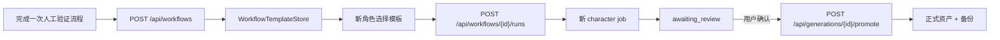

# Reusable Workflow Templates

## Product contract

工作流模板是“已验证的生产配置”，不是某次生成任务的快照。它保存：

- 项目视角、方向数量、画布尺寸和美术约束。
- 角色来源。
- Idle / Walk 动作描述与 FPS。
- 节点清单、实线连接、节点坐标与画布缩放/平移视口。
- 执行模式和最终审核策略。
- 模板版本、运行次数和最近运行时间。

它不保存：API Key、会话 Cookie、候选图片、job 输出、用户上传的原图或正式资产副本。

## Lifecycle



## Storage

- 目录：`generation-data/workflows/`
- 文件：`{templateId}.json`
- 实现：`server/windup_pipeline/workflow_store.py`
- 写入：先写 `.tmp`，再原子替换正式 JSON。
- 并发：进程内锁保护创建、列表和运行计数。

## Template example

```json
{
  "id": "abc123def456",
  "name": "Side character starter",
  "description": "Reusable side-view character workflow",
  "version": 1,
  "project": {
    "view": "side",
    "directions": "1",
    "canvasSize": "256",
    "style": "restrained low-saturation pixel art"
  },
  "pipeline": {
    "source": "zero",
    "actions": ["idle", "walk"],
    "fps": 8,
    "briefs": {
      "idle": "quiet breathing",
      "walk": "measured forward steps"
    }
  },
  "graph": {
    "version": 1,
    "nodes": ["source", "master-gen", "master", "walk-key", "idle-key", "walk-animation", "idle-animation", "publish"],
    "connections": [["source", "master-gen"], ["master-gen", "master"]],
    "positions": {"source": {"x": 70, "y": 280}},
    "viewport": {"x": -220, "y": 90, "scale": 0.82}
  },
  "execution": {
    "mode": "automatic",
    "approval": "final_asset"
  },
  "runCount": 0,
  "lastRunAt": null
}
```

## API

### List templates

```http
GET /api/workflows
```

### Save a template

```http
POST /api/workflows
Content-Type: application/json

{
  "name": "Side character starter",
  "description": "Reusable side-view character workflow",
  "project": {
    "view": "side",
    "directions": "1",
    "canvasSize": "256",
    "style": "restrained pixel art"
  },
  "pipeline": {
    "source": "zero",
    "actions": ["idle", "walk"],
    "fps": 8,
    "briefs": {
      "idle": "quiet breathing",
      "walk": "measured steps"
    }
  },
  "graph": {
    "version": 1,
    "nodes": ["source", "master-gen", "master", "walk-key", "idle-key", "walk-animation", "idle-animation", "publish"],
    "connections": [["source", "master-gen"], ["master-gen", "master"]],
    "positions": {"source": {"x": 70, "y": 280}},
    "viewport": {"x": -220, "y": 90, "scale": 0.82}
  },
  "execution": { "mode": "automatic" }
}
```

### Start a run

```http
POST /api/workflows/abc123def456/runs
Content-Type: application/json

{
  "name": "New Hero",
  "description": "A clear side-view courier with a readable silhouette."
}
```

返回的 job `request.workflow` 包含 `templateId`、`templateName`、`templateVersion` 和 `executionMode`，便于审计某个资产是由哪个流程版本产生的。

## Safety rules

1. 模板运行始终创建新 job，不复用旧 job 输出。
2. 候选资产始终停在 `awaiting_review`。
3. 没有显式 promote 时，不得写入正式资产。
4. promote 必须继续使用 `AssetPublisher` 的备份和原子入库边界。
5. 模板存储不接受或返回供应商凭据。

## Current limits

- 只支持母版 + Idle + Walk 标准画布。
- 模板 ID 不可变，当前只支持新建和运行，尚无 update/delete API。
- 当前是单机文件 Store，多实例部署前需替换为 SQLite/PostgreSQL 或具有一致性的存储。
- 前端演示进度与真实供应商 job 不共用时钟；最终以后端 job 状态为准。
